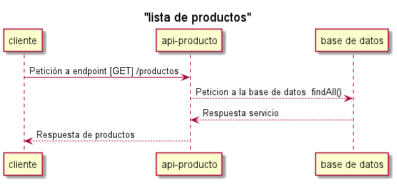

# Lista de productos
Este endpoint permite obtener el listado de productos.

* Ejecución servicio de listado de productos

# códigos
| http status code | code |
| - | - |
| 200              |  Enviado correctamente.
| 400              |  Error en los tipos de datos.
| 403              |  No autorizado.
| 500              |  Error interno.
